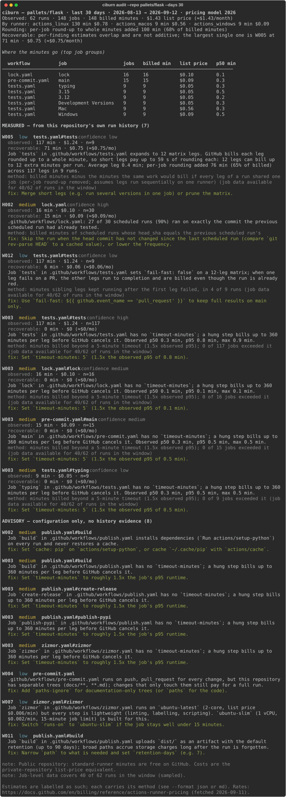

# ciburn

**What your GitHub Actions CI costs, and where the money goes to waste, from
your own run history.** Offline static analysis of `.github/workflows/`, joined
to the repository's actual runs, jobs and steps, priced under GitHub's 2026
rates. No LLM, no service, no telemetry.

```
$ ciburn audit --repo pallets/flask --days 30
```



The image above is the real terminal output of the command, rendered to SVG by
[`scripts/render_demo.py`](scripts/render_demo.py). Plain-text versions of real
runs: [`docs/example-pallets-flask.txt`](docs/example-pallets-flask.txt) (small
Python project, wide short matrix) and
[`docs/example-astral-sh-ruff.txt`](docs/example-astral-sh-ruff.txt) (large
project on third-party runners: minutes observed, nothing priced), and
[`docs/example-burntsushi-ripgrep.txt`](docs/example-burntsushi-ripgrep.txt)
(Rust project with a cross-platform matrix on hosted runners). All three were
produced by the wheel installed into an empty virtual environment.

## Why

CI waste is measured, not guessed. Bouzenia & Pradel's ICSE 2024 study of
1.3 million workflow runs across 952 repositories found that only 32.9 % of
paid-tier repositories use caching, only 14.0 % set a custom `timeout-minutes`
against the 360-minute default, and failed runs are 17.4 % of paid-tier runs
but 30.9 % of their VM time ([paper](https://software-lab.org/publications/icse2024_workflows.pdf)).

The price of that waste changed on 2026-01-01: GitHub cut hosted-runner list
prices by up to 39 % and folded a $0.002/minute platform charge into them; the
announced charge for self-hosted runners was postponed a day after it was
announced ([sources in RESEARCH.md](RESEARCH.md)). Most teams' mental model of
their CI bill is out of date, and the one rule that never changed, **every job
is rounded up to a whole minute**, is what makes wide matrices of short jobs
disproportionately expensive.

`actionlint` checks syntax. `zizmor` checks security. Neither joins a
workflow's configuration to that repository's run history and money. ciburn
does only that.

## What you get

Every finding is one of two kinds, and reporters never mix them:

- **Measured**: derived from this repository's own runs in the window. Carries
  observed billed minutes, list-price cost, the number of observations, an
  estimate of recoverable minutes and money, **the method used to estimate
  it**, a confidence level, and the evidence rows (run/job ids) it came from.
- **Advisory**: from configuration alone. No numbers. Shown separately.

An estimate is never presented as a measurement.

### Rules

| id | needs history | finding |
|---|---|---|
| W001 | no | PR-triggered workflow without `concurrency` + `cancel-in-progress` |
| W002 | no | dependency installation with no cache |
| W003 | no | job without `timeout-minutes` (exposure: 360-minute default) |
| W004 | no | push/PR trigger without `paths`/`paths-ignore` where the repo has docs trees |
| W005 | no | duplicate matrix legs, or legs so short that per-job rounding dominates |
| W006 | no | `actions/checkout` with `fetch-depth: 0` and no observable need |
| W007 | no | 2-core runner for lint/script jobs that fit `ubuntu-slim` |
| W008 | no | cron firing more often than daily |
| W009 | no | `push` + `pull_request` overlap: one commit runs twice |
| W010 | no | expensive PR job with no draft-PR guard |
| W011 | no | broad artifact upload at default retention |
| W012 | no | `fail-fast: false` on a wide matrix |
| H001 | yes | scheduled workflow failing k≥3 times in a row (dead cron) |
| H002 | yes | scheduled runs on a commit the previous scheduled run already tested |
| H003 | yes | job that has never failed and gates code: sampling candidate |
| H004 | yes | failure hotspot: failed runs take a disproportionate share of minutes |
| H005 | yes | p95 runtime far above median (flaky/hanging tail) |
| H006 | yes | re-run tax: minutes in run attempts ≥ 2 |
| H007 | yes | jobs killed by the 360-minute default timeout |
| H008 | yes | queue time a large share of wall time (latency, not money) |
| H009 | yes | expensive job running in parallel with a cheap gate that fails |

With history, W-rules are *measured*: W001 counts the minutes of PR runs that
were superseded while still running; W004 counts runs whose head commit touched
only docs; W005 computes what the same work would bill without per-job
rounding; W009 counts push runs duplicated by a PR run for the same commit, and
so on. `ciburn rules` prints the list; every method string is in the JSON
output.

## Install

Python 3.11+.

```bash
git clone https://github.com/addiiiooo/ciburn && cd ciburn
uv tool install .             # or: pipx install .   /   pip install .
ciburn --help
```

Once the first release is on PyPI: `uv tool install ciburn`, `pipx install
ciburn`, or `uvx ciburn`.

## Use

```bash
# inside a checkout with a github.com remote: static rules + history, auto-detected
ciburn audit

# any public repository, no checkout needed
ciburn audit --repo pallets/flask --days 90

# formats and CI gating
ciburn audit --format md --output report.md
ciburn audit --format json | jq '.summary'
ciburn audit --fail-on medium      # exit 1 when a medium/high finding exists

# what did this history cost before and after the 2026 repricing?
ciburn price --repo owner/name --compare

# a reviewable patch for the fixable findings; never commits
ciburn fix --rules W001,W003 > ciburn.patch && git apply ciburn.patch
```

Exit codes: `0` clean (or below `--fail-on`), `1` findings at/above `--fail-on`,
`2` error.

Suppress a rule for one file with a comment anywhere in it
(`# ciburn-ignore: W002, W011`) or globally with `--ignore W002`.

**Tokens and limits.** Without a token ciburn uses GitHub's unauthenticated
limit of 60 requests/hour and samples job data for at most 40 runs. Set
`GITHUB_TOKEN` (or `GH_TOKEN`) for 5,000 requests/hour and for private
repositories; the token needs `actions:read` (the default `GITHUB_TOKEN` inside
Actions has it). History is cached in SQLite at `~/.cache/ciburn/history.sqlite`
(`$CIBURN_CACHE` or `--cache` to move it) and re-runs only fetch what changed.

**Public repositories** are free on standard runners. ciburn prices them at the
private-repository list price and says so in every report, because that is the
only way to compare across repositories and it is what the same workflow would
cost a team that forks it privately.

### As a GitHub Action

```yaml
- uses: addiiiooo/ciburn@main
  with:
    days: 30
    fail-on: medium      # optional CI gate
    comment: "true"      # posts/updates a PR comment on pull_request events
```

The action needs `actions: read` and `pull-requests: write` permissions.

## How the money is computed

- Minutes per job = `completed_at - started_at` from the jobs API, **rounded up
  to the next whole minute per job**, which is exactly what GitHub does
  ([rule](https://docs.github.com/en/billing/reference/actions-runner-pricing)).
- Each job's runner label is mapped to a billing SKU (`ubuntu-latest` →
  `actions_linux`, `macos-latest` → `actions_macos`, `macos-*-large` →
  `macos_l`, …). Larger Linux/Windows runners use org-defined labels that
  cannot be recognised from the API; they are reported as *unpriced minutes*
  unless you pass `--label-sku LABEL=SKU`. Self-hosted and third-party runners
  are priced at $0 under the models in effect.
- Rates live in [`src/ciburn/data/pricing.yaml`](src/ciburn/data/pricing.yaml)
  with a `source_url` and `fetched_at` on every block. Nothing in the code
  hardcodes a price. A test fails when the file is older than 90 days.
- Three models ship: `2026` (in effect since 2026-01-01), `2025` (the rates
  before that, reconstructed from GitHub's own docs history), and
  `2026-selfhosted-announced` (the announced, then postponed, $0.002/minute
  self-hosted charge; a scenario, never the default).
- `--plan free|pro|team|enterprise` subtracts included minutes. GitHub does not
  document how non-Linux minutes draw down the quota today, so ciburn uses the
  list-price ratio and prints that assumption next to the number.

## Non-goals for v1

Deliberately out of scope: a web dashboard or hosted service; CI providers
other than GitHub Actions; any LLM call at runtime; auto-merge or auto-PR;
telemetry of any kind; a database server (SQLite only); authentication beyond a
user-supplied token.

## Prior art and credit

- [actionlint](https://github.com/rhysd/actionlint) (workflow syntax and semantics) and
  [zizmor](https://github.com/zizmorcore/zizmor) (workflow security) are the mature
  neighbours; run them too.
- [self-actuated/actions-usage](https://github.com/self-actuated/actions-usage) sums
  total minutes; [fchimpan/gh-slimify](https://github.com/fchimpan/gh-slimify) migrates
  jobs to `ubuntu-slim`.
- Bouzenia & Pradel, *Resource Usage and Optimization Opportunities in Workflows of
  GitHub Actions*, ICSE 2024, is the empirical baseline the rules were derived from.

What is new here: the join of configuration to that repository's own history
and money, pricing under more than one model, and the public corpus dataset
(see [REPORT.md](REPORT.md) once the scan completes).

ciburn is not affiliated with or endorsed by GitHub.

## Development

See [CONTRIBUTING.md](CONTRIBUTING.md). `uv sync --group dev && uv run pytest`.
Decisions taken during the build are in [DECISIONS.md](DECISIONS.md), the
research behind every price in [RESEARCH.md](RESEARCH.md), and the build log in
[RUNLOG.md](RUNLOG.md).

## License

MIT.
